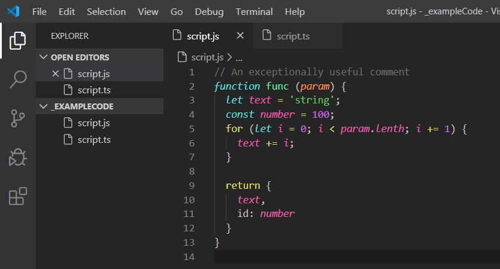
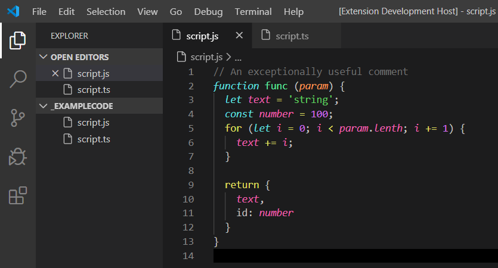
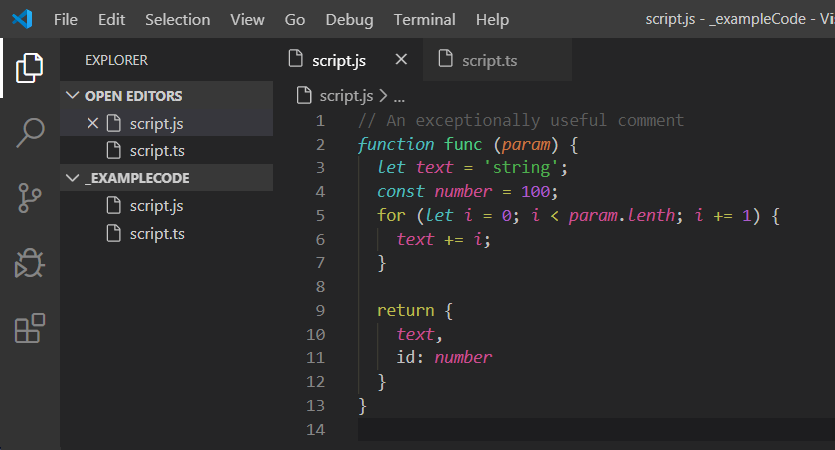
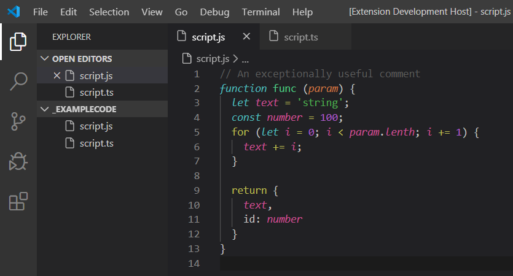
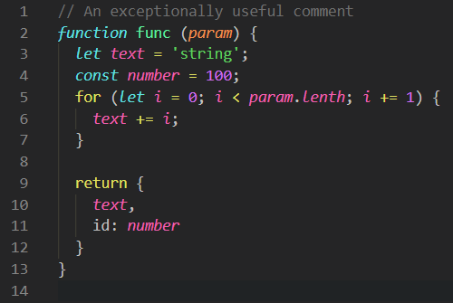
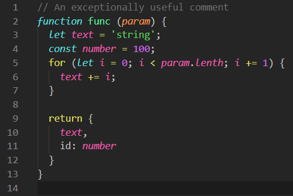
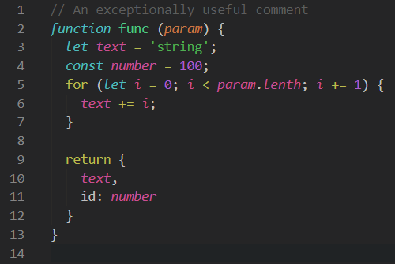
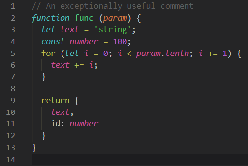

# Change Log

## [v0.0.3] - ??/02/2020

  - [Added]
    - Visual updates every version with a new N number vN.N.0
    - `Trepid Ink` && `Trepid Ink Soft` 
      - Editor unnecessary code opacity  
        Better visability to show you unnecessary code
        - Color: VS Code Default => #00000050
      - Editor line number styling 
        - Color: #707070  
      - Active line number [vscode issue 84772](https://github.com/microsoft/vscode/issues/84772)  
        Add `"editor.renderLineHighlight": "all"` or `"editor.renderLineHighlight": "gutter"`  
        To make the active line number working in your editor  
        - Color: #C0C0C0  
  - [Updated]
    - `Trepid Ink`
      - Class name color: `#A6E22E` => `#A6E725`
      - Inherited class: `#A6E22E` => `#7FB11B`
      - Line Highlight Background: `#000000` => `#030303`
    - `Trepid Ink Soft`:
      - Class name color: `#8ABC26` => `#97D618`
      - Inherited class: `#8ABC26` => `#75A516`

## [v0.0.2] - 24/02/2020

  - [Updated]
    - Colors for `Trepid Ink`  
      
    - Colors for `Trepid Ink Soft`  
       
    - Why an other color update?
      - Darker background to make more clear in the tabs what you have open
      - Darker select line because of the darker background
      - Creating a nice balance for an awesome workflow
      - Makes the soft a little more pop

## [v0.0.1] - 21/02/2020 - Initial release

  - [Fixed]
    - Rename base name `Trepid` => `Trepid Ink`.  
    Because old users of Trepid would have a double `Trepid` theme name.
  - [Updated]
    - Colors for `Trepid Ink`  
       
    - Colors for `Trepid Ink Soft`  
     

  - [Added]
    - `Trepid Ink` from the old `Trepid Bright`
    - `Trepid Ink Soft` from the old `Trepid`