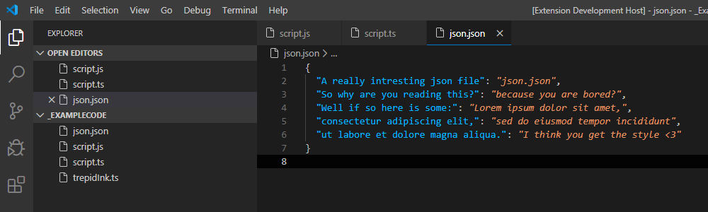

# Change Log

## [[v0.2.4] - 05/08/2020](https://github.com/squeeble-ink/vscode.trepid-ink/releases/tag/v0.2.4)

### [Security]

- Lodash from 4.17.15 to 4.17.19

### [Added]

- Language Comment Support
  - INO
  - JSX
  - TSX

### [Updated]

- Code styling

## [[v0.2.3] - 01/04/2020](https://github.com/squeeble-ink/vscode.trepid-ink/releases/tag/v0.2.3)

### [Added]

- Language Comment Support
  - C++

## [[v0.2.2] - 11/03/2020](https://github.com/squeeble-ink/vscode.trepid-ink/releases/tag/v0.2.2)

### [Fixed]

- [ISSUE #2](https://github.com/squeeble-ink/vscode.trepid-ink/issues/2)
  - Multi line comments did not color first caracters
  - JSDoc coloring broke before it needed to end

### [Updated]

- README
  - language support
- CHANGELOG
  - new version

### [Added]

- Language Comment Support
  - CSS

## [[v0.2.1] - 07/03/2020](https://github.com/squeeble-ink/vscode.trepid-ink/releases/tag/v0.2.1)

### [Fixed]

- [ISSUE #1](https://github.com/squeeble-ink/vscode.trepid-ink/issues/1)
  - JSDoc coloring contiued on next line
  - Multi line comments kept first color

### [Updated]

- Repo name  
  From `VSC-THM-TrepidInk` to `vscode.trepid-ink`
- README
  - added new settings info
  - new links
- CHANGELOG
  - release links to all releases
  - new version

### [Added]

- SETTINGS: `trepid-ink.delay`

## [[v0.2.0] - 05/03/2020](https://github.com/squeeble-ink/vscode.trepid-ink/releases/tag/v0.2.0)

### [Updated]

- README
  - Added gif with comment highlighting
  - Roadmap updated
  - New asset links
- CHANGELOG
  - New functions with comment highlighting
  - New asset links

### [Added]

- Trepid Ink Comments  
   
  - trepid-ink.comments:  
    `All` / `Block` / `Single` / `No`  
    Sets which comments you want to highlight
  - trepid-ink.tags:  
    The ["style" can have all vscode theming](https://code.visualstudio.com/api/references/vscode-api#ThemableDecorationRenderOptions):
    ```json
    "trepid-ink.tags": [
      {
        "style": {
          "color": "#6bf7f7"
        },
        "tag": "NOTE"
      },
      {
        "style": {
          "color": "#ff893a"
        },
        "tag": "TODO"
      },
      {
        "style": {
          "color": "#ff3333"
        },
        "tag": "FixMe"
      }
    ]
    ```

## [[v0.1.1] - 01/03/2020](https://github.com/squeeble-ink/vscode.trepid-ink/releases/tag/v0.1.1)

### [Updated]

- README
  - Images to represent correct colors
  - Roadmap updated
- CHANGELOG
  - Styling for better readability
  - Removed unnecessary text

## [[v0.1.0] - 29/02/2020](https://github.com/squeeble-ink/vscode.trepid-ink/releases/tag/v0.1.0)

### [Removed]

- `Trepid Ink Soft` Because small to no differences  
  May be added back in a later version

### [Added]

- Trepid Ink logo  
  

### [Updated]

- Trepid Ink colors  
  [v0.0.3]  
    
    
  [v0.1.0]  
    
  

## [[v0.0.3] - 24/02/2020](https://github.com/squeeble-ink/vscode.trepid-ink/releases/tag/v0.0.3)

### [Added]

- Visual updates every version with a new N number vN.N.0
- `Trepid Ink` && `Trepid Ink Soft`
  - Editor unnecessary code opacity  
    Better visability to show you unnecessary code
    - Color: VS Code Default => `#00000050`
  - Editor line number styling
    - Color: `#707070`
  - Active line number [vscode issue 84772](https://github.com/microsoft/vscode/issues/84772)  
    Add `"editor.renderLineHighlight": "all"` or  
    `"editor.renderLineHighlight": "gutter"`  
    To make the active line number working in your editor
    - Color: #C0C0C0

### [Updated]

- `Trepid Ink`
  - Class name color: `#A6E22E` => `#A6E725`
  - Inherited class: `#A6E22E` => `#7FB11B`
  - Line Highlight Background: `#000000` => `#030303`
- `Trepid Ink Soft`:
  - Class name color: `#8ABC26` => `#97D618`
  - Inherited class: `#8ABC26` => `#75A516`

## [[v0.0.2] - 24/02/2020](https://github.com/squeeble-ink/vscode.trepid-ink/releases/tag/v0.0.2)

### [Updated]

- Colors for `Trepid Ink`  
  [v0.0.1]
    
  [v0.0.2]
  
- Colors for `Trepid Ink Soft`  
  [v0.0.1]
    
  [v0.0.2]
  

## [[v0.0.1] - 21/02/2020 - Initial release](https://github.com/squeeble-ink/vscode.trepid-ink/releases/tag/v0.0.1)

### [Fixed]

- Rename base name `Trepid` => `Trepid Ink`.  
  Because old users of Trepid would have a double `Trepid` theme name.

### [Updated]

- Colors for `Trepid Ink`  
   From:  
    
   To:  
  
- Colors for `Trepid Ink Soft`  
   From:  
    
   To:  
  

### [Added]

- `Trepid Ink` from the old `Trepid Bright`
- `Trepid Ink Soft` from the old `Trepid`
