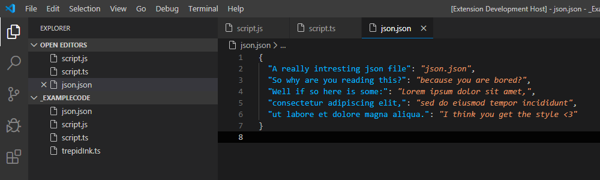

#  Trepid Ink

A color theme for [Visual Studio Code](https://code.visualstudio.com/) designed to mix well with its interface. Integrated with a comment higlight extension for todo's and fix me's. The theme `Trepid Ink` is inspired and cloned from the original [`Trepid`](https://github.com/EnKrypt/Trepid) build by [EnKrypt](https://github.com/EnKrypt/)

## Trepid Ink  
  
  

## Features

### TODO Highlighting: 
*[TODO comment image]*

### FixMe Highlighting:
*[FixMe comment image]*

### Custom comment highlights:
This extension contributes the following settings:

* `trepid-ink.enable-highlight-comments`: enable/disable this extension
* `trepid-ink.thing`: set to `blah` to do something

## Roadmap / Updates vs [Trepid](https://github.com/EnKrypt/Trepid)
[vN.N.N] when fist added in a version or removed

- Themes
  - [[v0.0.1]](https://github.com/SqueebleInk/VSC-THM-TrepidInk/blob/master/CHANGELOG.md#v001---21022020---initial-release) Trepid Ink
    - Updating: New render engine
    - Renaming: Trepid Bright => Trepid Ink
  - [[v0.0.1]](https://github.com/SqueebleInk/VSC-THM-TrepidInk/blob/master/CHANGELOG.md#v001---21022020---initial-release) Trepid Ink Soft
    - **REMOVED** in [[v0.1.0]](https://github.com/SqueebleInk/VSC-THM-TrepidInk/releases/tag/v0.1.0)  
      Because small to no differences. May be added back in a later version
    - Updating: New render engine
    - Renaming: Trepid => Trepid Ink Soft
  - Trepid Ink Bright
    - Adding light edition for the light coders 
  - Trepid Ink Light
    - **NOTE**: Low to no change of being added
    - Adding a softer color palette version of the Trepid Ink Brighty
- Funtions
  - Comments
    - TODO highlights
    - FixMe highlights
  - Comments Settings
    - Custom highlights