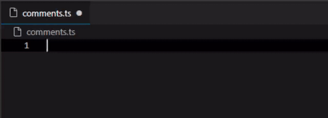

# Trepid Ink

A color theme for [Visual Studio Code](https://code.visualstudio.com/) designed to be more then just a theme. Integrated with a comment higlight extension for todo's and fix me's.  
The theme `Trepid Ink` is inspired and cloned from the original [`Trepid`](https://github.com/EnKrypt/Trepid) build by [EnKrypt](https://github.com/EnKrypt/)

## Trepid Ink  
  
  

## Features

Note that colors are incorrect because of mp4 to gif convertion
  

### Custom comment highlights:
This extension contributes the following settings:

- trepid-ink.delay:  
  Delay it takes to style the comments  
  **NOTE:** Do not set it on 0!
- trepid-ink.comments:  
  `All` / `Block` / `Single` / `No`  
  Sets which comments you want to highlight
- trepid-ink.tags:  
  The ["style" can have all vscode theming](https://code.visualstudio.com/api/references/vscode-api#ThemableDecorationRenderOptions):
  ```json
  "trepid-ink.tags": [
    {
      "style": {
        "color": "#6bf7f7"
      },
      "tag": "NOTE"
    },
    {
      "style": {
        "color": "#ff893a"
      },
      "tag": "TODO"
    },
    {
      "style": {
        "color": "#ff3333"
      },
      "tag": "FixMe"
    }
  ]
  ```

### Supported languages
- JavaScript
- TypeScript
- CSS

## Roadmap / Updates vs [Trepid](https://github.com/EnKrypt/Trepid)
[vN.N.N] when fist added in a version or removed

- Themes
  - [[v0.0.1]](https://github.com/squeeble-ink/vscode.trepid-ink/blob/master/CHANGELOG.md#v001---21022020---initial-release) Trepid Ink
    - Updating: New render engine
    - Renaming: Trepid Bright => Trepid Ink
  - [[v0.0.1]](https://github.com/squeeble-ink/vscode.trepid-ink/blob/master/CHANGELOG.md#v001---21022020---initial-release) Trepid Ink Soft
    - **REMOVED** in [[v0.1.0]](https://github.com/SqueebleInk/VSC-THM-TrepidInk/releases/tag/v0.1.0)  
      Because small to no differences. May be added back in a later version
    - Updating: New render engine
    - Renaming: Trepid => Trepid Ink Soft
  - Trepid Ink Bright
    - Adding light edition for the light coders 
  - Trepid Ink Light
    - **NOTE**: Low to no change of being added
    - Adding a softer color palette version of the Trepid Ink Brighty
- Funtions
  - [[v0.2.0]](https://github.com/squeeble-ink/vscode.trepid-ink/releases/tag/v0.2.0) Comments
    - NOTE highlights
    - TODO highlights
    - FixMe highlights
  - [[v0.2.0]](https://github.com/squeeble-ink/vscode.trepid-ink/releases/tag/v0.2.0) Comments Settings
    - Custom highlights